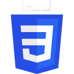

### Hi there 👋

<strong>Welcome to my Github Profile.</strong> Shrabon is a seasoned frontend developer with expertise in HTML5, CSS3, Bootstrap, Tailwind, JavaScript, and React. With a keen eye for design and a passion for creating seamless user experiences, Shrabon excels in translating creative concepts into responsive and visually appealing web applications. Their proficiency in the latest frontend technologies, coupled with a collaborative approach, makes Shrabon a valuable asset in delivering innovative and user-friendly solutions.

<h3>My Expertise Is:</h3>
<ul style="display: flex; align-items: center; list-style: none;">
    <li></li>
    <li></li>
    <li></li>
    <li></li>
    <li></li>
    <li></li>
    <li></li>
    <li></li>

</ul>

